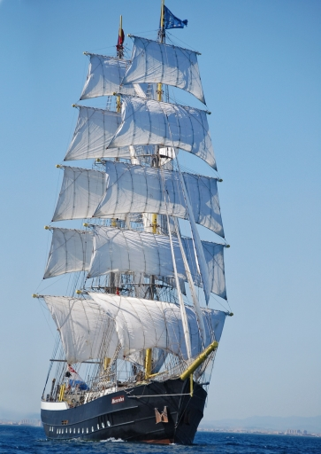
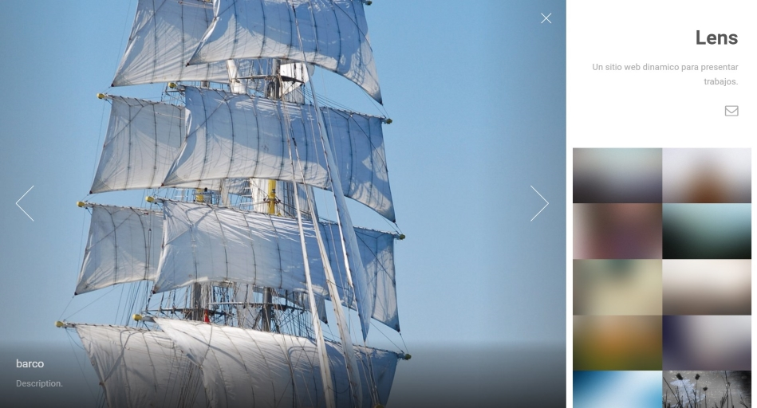
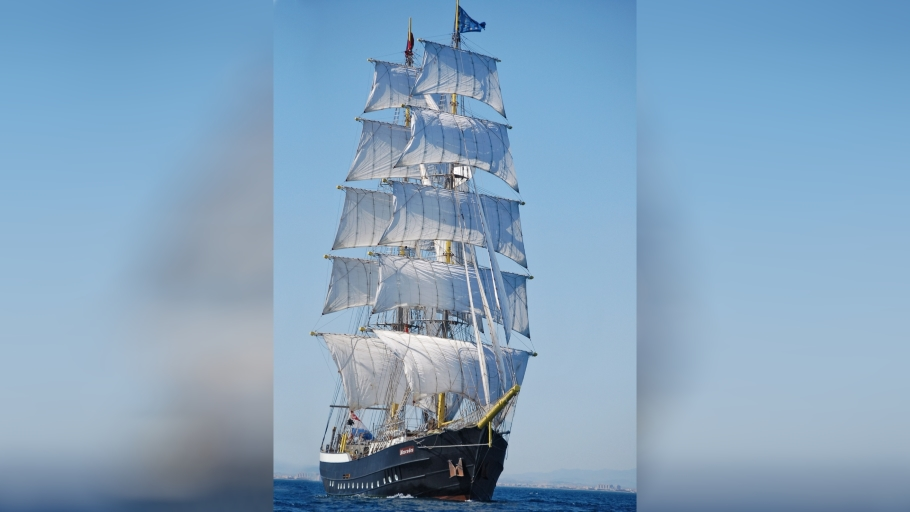
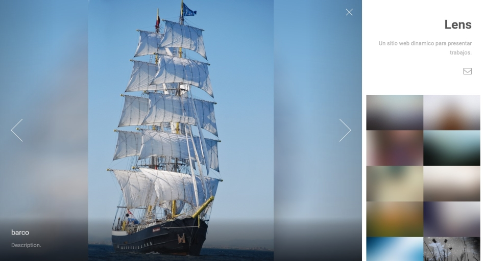

# Template Lens

Por [FWebistes](productions.github.io)

## Instrucciones del sitio

Para agregar imagenes al sitio, entrar al album de imgur y agregar imagenes. Las mismas se van a ver cada vez que entre a su sitio.

### Formate de las imagenes

Las imagenes ocupan gran parte del sitio y se les aplica un zoom para que ocupen todo el ancho de su espacio, por ende si la imagen es alta, y no ancha, se va a ver solo una parte porque se va a aplicar un zoom. Es recomendable que estas imagenes tengan un tamaño de [aspecto de 16 : 9](https://pacoup.com/2011/06/12/list-of-true-169-resolutions/) (el link prove todas las opciones disponibles), pero el tamaño ideal seria **que la imagen sea 1920 pixeles de ancho y 1080 pixeles de alto**.

Un ejemplo, digamos que tenemos esta imagen:

Si subimos esta imagen, la cual es alta y no ancha, el sitio la modificaria para que se vea asi:

Lo correcto, para evitar eso, seria aplicar una edicion, para que se vea ancha, por ejemplo realizar algo asi:

Y en el sitio se veria asi:

---

En caso de tener dudas, no duden en consultarme.